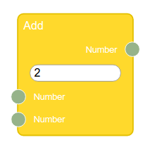

Nodes
=



All nodes can contain name, inputs, outputs and controls. 

**Name** must identify a node and point to the target of node.

**Inputs** and **outputs** should be located on the left and right of the node, respectively. They are represented by a [Socket](Sockets) and can have names. All outputs can have an unlimited number of connections. By default inputs can only have one connection. You can change this passing the third parameter as `true`:
```js
var multiInput = new Rete.Input('num', 'Number', numSocket, true); 
```

**[Controls](Controls)** can be located either directly at the node itself, or refers to a specific input. In fact, the location in the first case is defined in the standart template of a [Renderer plugin](Plugins#renderer). In the second case, the control is displayed when there is no connection at the input. This is necessary to ensure that the control is responsible for providing input data when they are not transferred from another node.

Let's create node:
```js 
var in1 = new Rete.Input('num1', 'Number', numSocket); 
var in2 = new Rete.Input('num2', 'Number', numSocket, true); // can have multiple connections
var out = new Rete.Output('Number', numSocket); // the third parameter must be false to deny multiple connections

var numControl = new NumControl();

var numNode = new Rete.Node('Add');
numNode.addInput(in1);
numNode.addInput(in2);
numNode.addControl(numControl);
numNode.addOutput(out);

```
Bear in mind that such arbitrary creation of nodes can be appropriate only in rare cases, so usually nodes should be created inside the component in the component