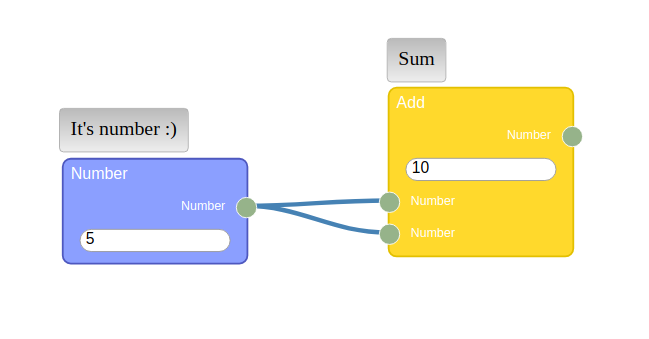
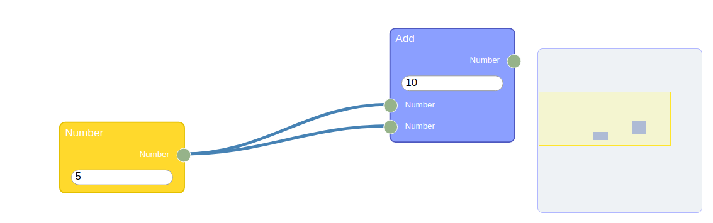

Plugins
=

### Connection [](https://www.npmjs.com/package/rete-connection-plugin)

```js
import ConnectionPlugin from 'rete-connection-plugin';

editor.use(ConnectionPlugin, { curvature: 0.4 });
```
This plugin is required for full-fledged work of the editor, as it is responsible for displaying and managing connections.

### Vue Render [](https://www.npmjs.com/package/rete-vue-render-plugin)

```js
import VueRenderPlugin from 'rete-vue-render-plugin';

editor.use(VueRenderPlugin);
```

```js
import CustomNodeComponent from './CustomNodeComponent.vue';
import CustomControlComponent from './CustomControlComponent.vue';

class MyComponent extends Rete.Component {
    constructor(){
        // ...
        this.render = 'vue';
        this.data.component = CustomNodeComponent; // Vue.js component, not required
        this.data.props = {}; // props for the component above, not required
    }
}

class MyControl extends Rete.Control {
    constructor(){
        // ...
        this.render = 'vue';
        this.component = CustomControlComponent; // Vue.js component, required
        this.props = {}; // props for the component above, not required
    }
}
```

`CustomNodeComponent` and `CustomControlComponent` are conventional Vue.js components. `Rete.Control` requires component while `Rete.Component` may use the default [Node.vue](https://github.com/retejs/vue-render-plugin/blob/master/src/Node.vue) component. On the basis of it you can create your own components or extend them. `getData` and `putData` will be accessed from your component through props. After changing Node's elements dynamically (add Input/Output, etc.) you must call `node.update()` or `control.update()`


### Stage0 Render [](https://www.npmjs.com/package/rete-stage0-render-plugin)  <span style="color:green">lightweight</span>

Rete renderer using https://www.npmjs.com/package/stage0 (~1.6 kb framewok)

Example: https://codepen.io/anon/pen/jQBxKe

```js
import Stage0RenderPlugin from 'rete-stage0-render-plugin';

editor.use(Stage0RenderPlugin);
```

```js
import CustomNodeComponent from './CustomNodeComponent.js';

class MyComponent extends Rete.Component {
    constructor(){
        // ...
        this.data.render = 'stage0';
        this.data.component = CustomNodeComponent; // stage0.js component, not required
        this.data.props = {}; // props for the component above, not required
    }
}
const node = editor.nodes[0];
const control = node.controls.get('ctrl');

node.update(); // force update
control.update(); // of view

// in some cases you can get stage0.js context
node.stage0Context
control.stage0Context
```

### Alight Render [](https://www.npmjs.com/package/rete-alight-render-plugin)  <span style="color:red">deprecated</span>

```js
import AlightRenderPlugin from 'rete-alight-render-plugin';

editor.use(AlightRenderPlugin, { template: '<div ...>' }); // global template

class MyComponent extends Component {
    constructor(){
        // ...
        this.data.render = 'alight'; // required if used more than one render plugin
        this.data.template = '<div ...>'; // component specific template
    }
}
```
It's also a necessary plugin, but it can be replaced with the same plugin that uses a library other than Angular Light to render the data

### Context menu [](https://www.npmjs.com/package/rete-context-menu-plugin)

```js
import ContextMenuPlugin from 'rete-context-menu-plugin';

editor.use(ContextMenuPlugin, {
    searchBar: false,
    delay: 100,
    allocate(component) {
        return ['Submenu']
    },
    items: {
        'Click me'(){ console.log('Works!') }
    }
});
```
| Options | Description | Default |
|-|-|-|
| `searchBar` | Showing search bar | `true`
| `delay` | Delay hide, ms | `1000`
| `allocate` | function for placing of components into submenu | `() => []`
| `items` | custom items (`Object` with nested objects and functions) | `{}`


You can arbitrarily put a component in a submenu. Examples:

```js
allocate() { return ["Single submenu"] }
```

```js
allocate(component) { return component.path } // where path is a stack of menu for every component
```


```js
allocate(component) { return null } // exclude component from menu items
```

### Stage0 Menu [](https://www.npmjs.com/package/rete-stage0-menu-plugin)  <span style="color:green">lightweight</span>

```js
import Stage0MenuPlugin from 'rete-stage0-menu-plugin';

editor.use(Stage0MenuPlugin, {
    searchBar: false,
    delay: 100,
    docked: true,
    allocate(component) {
        if (component.name == "Number") {
            return false;
        }
        return ["submenu", "subsubmenu"];
    },
    items: {
        "Menu": {
            "Add component": components[1],
            "Fn": () => {
                alert("Fn");
            }
        }
    }
});
```
| Options | Description | Default |
|-|-|-|
| `searchBar` | Showing search bar | `true`
| `delay` | Delay hide, ms | `100`
| `allocate` | function for placing of components into submenu (return false to exclude) | `() => []`
| `docked` | If you want Blender style docked menu | `false`
| `items` | Hand crafted menu | `{}`

### Keyboard [](https://www.npmjs.com/package/rete-keyboard-plugin)

```js
import KeyboardPlugin from 'rete-keyboard-plugin';

editor.use(KeyboardPlugin);
```
Handles keydown events for keys such as "Delete" (remove node) or "Space" (open context menu)

### Module [](https://www.npmjs.com/package/rete-module-plugin)

```js
import ModulePlugin from 'rete-module-plugin';

editor.use(ModulePlugin, { engine, modules });
```

where `modules` is an associative array with objects

For instance:

```js
var modules = {
  'index.rete': { data: initialData() }
}
```

There should be at least 3 types of nodes: Input, Output and Module. Their components should have the following properties respectively:
```js
this.module = {
    nodeType: 'input',
    socket: numSocket
}

this.module = {
    nodeType: 'output',
    socket: numSocket
}

this.module = {
    nodeType: 'module'
}
```

The plugin itself will add inputs and outputs to the Module node, but in the rest you must add them manually


[Example](https://github.com/retejs/examples/tree/master/Module)

### Profiler [](https://www.npmjs.com/package/rete-profiler-plugin)

```js
import ProfilerPlugin from 'rete-profiler-plugin';

engine.use(ProfilerPlugin, { editor, enabled: true }); // editor can be optional
```

This plugin adds an element to each node to display the elapsed time by the worker, and prints the builder time to the console.

### Readonly [](https://www.npmjs.com/package/rete-readonly-plugin)

```js
import ReadonlyPlugin from 'rete-readonly-plugin';

editor.use(ReadonlyPlugin, { enabled: false });
```

This plugin prevents a follow events:

- keydown
- nodetranslate
- nodeselect
- connectioncreate
- connectionremove
- nodecreate
- noderemove

Thus, thanks to the event architecture, these functions can be implemented without interfering with the library code.

### Task [](https://www.npmjs.com/package/rete-task-plugin)

```js
import TaskPlugin from 'rete-task-plugin';

editor.use(TaskPlugin);
```

Example of use:

```js
// inside of component's constructor
this.task = {
    outputs: {num1: 'option', num2: 'output'},
    init(task) {  // сalled when initializing all tasks (at the engine.process())
        task.run('any data');
        task.reset();
    }
}

// workers should look as follows:
worker(node, inputs, data) { // data is 'any data' from run()
    console.log('Keydown event', node.id, data);
    // inputs['inp_num1']
    this.closed = ['num1']; // prevents the call of the Tasks, which are connected to the current task through the first 'option' socket
    return {num2: data} // return output data
}
```

[Full code](https://github.com/retejs/examples/tree/master/Tasks)

### Comment [](https://www.npmjs.com/package/rete-comment-plugin)

Comment plugin supports two kinds of comments: **inline** and **frame**.

Inline comment are attached to target node.

Frame comments are used as group replacements because it doesn't affect processing and simply helps the developer explore the graph.



```js
import CommentPlugin from 'rete-comment-plugin';

editor.use(CommentPlugin, { margin: 20 });
```


### Minimap [](https://www.npmjs.com/package/rete-minimap-plugin)



```js
import MinimapPlugin from 'rete-minimap-plugin';

editor.use(MinimapPlugin);
```

### Connection path [](https://www.npmjs.com/package/rete-connection-path-plugin)

```js
import ConnectionPathPlugin from 'rete-connection-path-plugin';

editor.use(ConnectionPathPlugin, {
    type: ConnectionPathPlugin.DEFAULT, // DEFAULT or LINEAR transformer
    transformer: () => ([x1, y1, x2, y2]) => [[x1, y1], [x2, y2]], // optional, custom transformer
    curve: ConnectionPathPlugin.curveBundle, // curve identifier
    options: { vertical: false, curvature: 0.4 }, // optional
    arrow: { color: 'steelblue', marker: 'M-5,-10 L-5,10 L20,0 z' }
});
```

### Connection reroute [](https://www.npmjs.com/package/rete-connection-reroute-plugin)

```js
import ConnectionReroutePlugin from 'rete-connection-reroute-plugin';

editor.use(ConnectionReroutePlugin);
```
